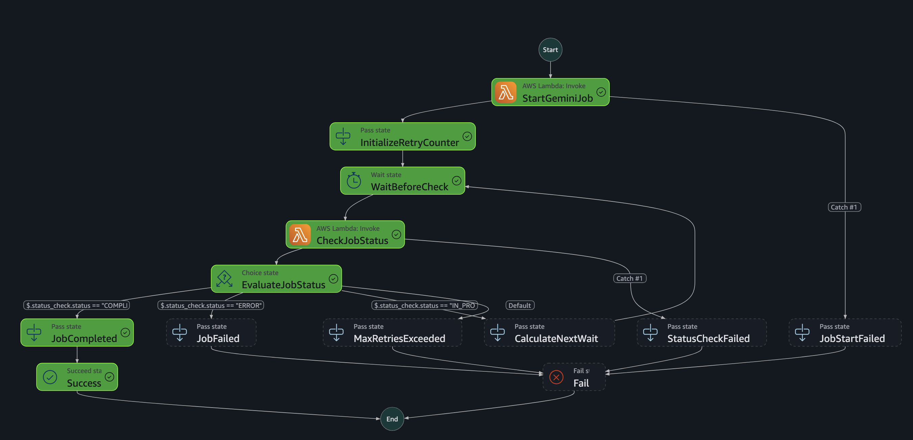

# 🚀 Build with AI - GDG Serverless Pipeline

<div align="center">


*A fully serverless AI-powered data processing pipeline built for Google Developer Group (GDG) presentation*

[🏗️ Architecture](#️-architecture-overview) • [🚀 Quick Start](#-quick-start) • [📊 Features](#-key-features) • [🔧 Configuration](#-configuration)

</div>

---

## 🎯 Overview

This project demonstrates a production-ready serverless data pipeline on AWS that processes CSV files containing questions and enriches them using Google's Gemini AI API. Built with infrastructure as code principles and modern serverless patterns.

### ✨ Key Features

- **🔄 Event-Driven Architecture**: Automatic processing triggered by S3 uploads
- **🤖 AI-Powered Analysis**: Structured question analysis using Gemini AI with Pydantic models
- **📈 Scalable & Resilient**: Built-in retry logic with exponential backoff
- **🔒 Security First**: Secrets management, IAM least privilege, encryption at rest
- **📊 Monitoring Ready**: CloudWatch integration and structured logging
- **🏗️ Infrastructure as Code**: Complete Terraform automation
- **💰 Cost Optimized**: Pay-per-use serverless architecture

---

## 🏗️ Architecture Overview


### 🎯 How to Trigger the Pipeline
The pipeline is **automatically triggered** when you upload a CSV file to the input S3 bucket. Here's how it works:

### 🔄 Step Functions Workflow



*Complete Step Functions state machine showing the AI processing pipeline with retry logic, error handling, and multiple execution paths*

### 🔧 Core Components

| Component | Purpose | Technology |
|-----------|---------|------------|
| **S3 Buckets** | Input/Output file storage | AWS S3 |
| **EventBridge** | Event detection and routing | AWS EventBridge |
| **Step Functions** | Workflow orchestration | AWS Step Functions |
| **Lambda Functions** | Processing logic | Python 3.12 |
| **Secrets Manager** | API key management | AWS Secrets Manager |
| **IAM Roles** | Security and access control | AWS IAM |

### 📊 Processing Flow

1. **📤 File Upload**: CSV file uploaded to input S3 bucket
2. **🔔 Event Detection**: EventBridge detects S3 object creation
3. **⚡ Workflow Start**: Step Functions state machine triggered
4. **🤖 AI Processing**: Lambda reads CSV, processes with Gemini AI
5. **✅ Status Check**: Verification Lambda monitors processing
6. **🔄 Retry Logic**: Exponential backoff for failed requests
7. **💾 Results Storage**: Processed data saved to output S3 bucket

---

## 🚀 Quick Start

### Prerequisites

- ✅ AWS CLI configured with appropriate permissions
- ✅ Terraform >= 1.0 installed
- ✅ Docker running (for Lambda layer builds)
- ✅ Google Gemini API key

### 1️⃣ Clone & Setup

```bash
git clone <your-repository-url>
cd build-with-ai-gdg
```

### 2️⃣ Configure Environment

Create your `terraform.tfvars` file:

```hcl
# Required
gemini_api_key = "your-gemini-api-key-here"

# Optional (with defaults)
aws_region = "us-east-2"
environment = "dev"
s3_bucket_data_prefix_name = "pipeline-data-gemini"
```

### 3️⃣ Deploy Infrastructure

```bash
# Initialize Terraform
terraform init

# Review planned changes
terraform plan

# Deploy infrastructure
terraform apply
```

### 4️⃣ Test the Pipeline

```bash
# Upload test file
aws s3 cp data/data_test.csv s3://pipeline-data-gemini-dev/

# Monitor execution
aws stepfunctions list-executions \
  --state-machine-arn $(terraform output -raw state_machine_arn)
```

---

## 📁 Project Structure

```
build-with-ai-gdg/
├── 📄 main.tf                    # Root Terraform configuration
├── 📄 variables.tf               # Root variables definition
├── 📄 terraform.tfvars          # Environment configuration (gitignored)
├── 📊 data/
│   └── data_test.csv            # Sample test data
├── 🏗️ modules/
│   └── s3_sfn_pipeline/
│       ├── 🐍 lambda/
│       │   ├── requirements.txt
│       │   ├── sfn_start_job/
│       │   │   ├── sfn_start_job.py    # Main processing logic
│       │   │   └── sfn_start_job.zip   # Deployment package
│       │   └── sfn_verify_status/
│       │       ├── sfn_verify_status.py # Status verification
│       │       └── sfn_verify_status.zip
│       └── 🏗️ terraform/
│           ├── 1_trigger.tf      # S3 & EventBridge
│           ├── 2_lambda.tf       # Lambda functions & layers
│           ├── 3_sfn.tf          # Step Functions workflow
│           ├── 4_iam.tf          # IAM roles & policies
│           ├── 5_secrets.tf      # Secrets Manager
│           ├── variables.tf      # Module variables
│           └── outputs.tf        # Module outputs
└── 🔨 build/                    # Generated artifacts (gitignored)
```

---

## 🔧 Configuration

### 🌍 Environment Variables

| Variable | Description | Default | Required |
|----------|-------------|---------|----------|
| `gemini_api_key` | Google Gemini API key | - | ✅ |
| `aws_region` | AWS deployment region | `us-east-2` | ❌ |
| `environment` | Environment name | `dev` | ❌ |
| `s3_bucket_data_prefix_name` | S3 bucket prefix | `pipeline-data-gemini` | ❌ |

### ⚙️ Lambda Configuration

```hcl
Runtime: Python 3.12
Architecture: x86_64
Timeout: 60 seconds
Memory: 512MB
```

**Key Dependencies (Version Pinned):**
- `boto3==1.38.42` - AWS SDK for Python
- `google-genai==1.21.1` - Google Gemini AI API client
- `pydantic==2.11.7` - Data validation and parsing
- `requests==2.32.4` - HTTP library for API calls

> **Note**: All dependencies are version-pinned in `requirements.txt` to ensure consistent builds and avoid compatibility issues in production.

### 🔄 Step Functions Retry Policy

```json
{
  "retry_policy": {
    "max_attempts": 20,
    "initial_wait": 15,
    "backoff_rate": 2.0,
    "max_wait": 900
  }
}
```

---

## 📊 Input/Output Format

### 📥 Input CSV Format

Your CSV file should contain a column with "pergunta" (question) in the name:

```csv
pergunta
qual o objetivo do seminario?
quais foram as tecnologias utilizadas?
como posso fazer isso no GCP?
Posso utilizar essa mesma estrutura e utilizar a OPENAI?
```

### 📤 Output JSON Format

Processed results are saved as structured JSON with Pydantic validation:

```json
{
  "timestamp": "2025-06-25T11:47:46.643832",
  "structured_analysis": {
    "total_questions": 4,
    "questions_answers": [
      {
        "question": "qual o objetivo do seminario?",
        "answer": "O objetivo principal deste seminário, no contexto do projeto 'Build with AI - GDG', é demonstrar de forma prática como construir e orquestrar soluções de inteligência artificial generativa utilizando uma arquitetura serverless robusta na AWS. Mostramos a integração de serviços nativos da AWS, como S3, EventBridge, Step Functions e Lambda, com APIs de IA de terceiros, como a do Gemini, para criar um pipeline de dados automatizado e escalável. O foco é capacitar a audiência do Google Developer Group (GDG) a aplicar esses conceitos em seus próprios projetos de IA, enfatizando a facilidade de desenvolvimento, a segurança e a resiliência operacional.",
        "category": "Objetivo",
        "technical_level": "basic",
        "aws_services_mentioned": [
          "S3",
          "EventBridge",
          "Lambda",
          "Step Functions"
        ]
      },
      {
        "question": "quais foram as tecnologias utilizadas?",
        "answer": "Neste projeto, empregamos um conjunto de tecnologias para construir o pipeline de dados serverless com IA. Na AWS, utilizamos o S3 para armazenamento de dados, EventBridge para detecção de eventos, Step Functions para orquestração do fluxo de trabalho com lógica de retry, Lambda Functions para o processamento central e interação com a API de IA, Secrets Manager para gerenciamento seguro da chave da API do Gemini, e IAM Roles para controle de acesso com o princípio de privilégio mínimo. A infraestrutura foi totalmente definida como código utilizando Terraform. A linguagem de programação para as Lambda Functions foi Python 3.12, aproveitando bibliotecas como boto3 para interação com serviços AWS e google-genai para comunicação com a API do Gemini. A arquitetura é puramente serverless, e o monitoramento é intrínseco via CloudWatch.",
        "category": "Tecnologias",
        "technical_level": "basic",
        "aws_services_mentioned": [
          "S3",
          "EventBridge",
          "Step Functions",
          "Lambda",
          "Secrets Manager",
          "IAM",
          "CloudWatch"
        ]
      },
      {
        "question": "como posso fazer isso no GCP?",
        "answer": "Embora nosso projeto seja especificamente construído na AWS, os princípios arquiteturais serverless são universalmente aplicáveis em qualquer provedor de nuvem, incluindo o Google Cloud Platform (GCP). Você poderia replicar essa funcionalidade no GCP utilizando serviços equivalentes: para armazenamento de arquivos CSV (S3), usaria o Cloud Storage; para detecção de eventos (EventBridge), Eventarc ou Cloud Pub/Sub; para orquestração do fluxo de processamento (Step Functions), Workflows; para as funções de processamento (Lambda Functions), Cloud Functions; e para gerenciar a chave da API do Gemini de forma segura (Secrets Manager), o Secret Manager do GCP. O controle de acesso seria feito via IAM do GCP. A lógica dentro das funções para interagir com APIs de IA e processar dados permaneceria similar, apenas adaptada às bibliotecas e SDKs do GCP.",
        "category": "Comparação",
        "technical_level": "intermediate",
        "aws_services_mentioned": [
          "S3",
          "EventBridge",
          "Lambda",
          "Step Functions",
          "Secrets Manager",
          "IAM"
        ]
      },
      {
        "question": "Posso utilizar essa mesma estrutura e utilizar a OPENAI?",
        "answer": "Com certeza! A flexibilidade é um dos pontos fortes dessa arquitetura serverless. O design do pipeline é agnóstico em relação à API de IA utilizada. Para mudar do Gemini para a OpenAI, as modificações seriam mínimas e estariam concentradas principalmente na Lambda Function responsável pela interação com a API de IA (`sfn_start_job`). Você precisaria substituir a biblioteca `google-genai` pela biblioteca `openai` do Python, ajustar a chamada da API e o tratamento da resposta para o formato esperado da OpenAI. A chave da API da OpenAI seria armazenada de forma segura no Secrets Manager, assim como fazemos com a chave do Gemini. Os demais componentes do pipeline – S3, EventBridge, Step Functions e IAM – permaneceriam inalterados, demonstrando a reutilização e adaptabilidade da arquitetura.",
        "category": "Adaptabilidade",
        "technical_level": "intermediate",
        "aws_services_mentioned": [
          "S3",
          "EventBridge",
          "Lambda",
          "Step Functions",
          "Secrets Manager",
          "IAM"
        ]
      }
    ],
    "summary": "O projeto 'Build with AI - GDG' demonstra um pipeline de dados serverless completo na AWS, orquestrando S3, EventBridge, Step Functions e Lambda para integrar-se com APIs de IA generativa (Gemini). A solução é construída com Infrastructure as Code (Terraform) em Python, enfatizando escalabilidade, segurança (IAM, Secrets Manager) e resiliência, servindo como um blueprint prático para a construção de soluções de IA na nuvem.",
    "key_topics": [
      "Serverless Architecture",
      "Data Pipelines",
      "Generative AI Integration",
      "AWS Services",
      "Infrastructure as Code",
      "Security",
      "Scalability",
      "Cloud Agnostic Patterns",
      "Orchestration"
    ],
    "raw_response_text": "{\n  \"total_questions\": 4,\n  \"questions_answers\": [\n    {\n      \"question\": \"qual o objetivo do seminario?\",\n      \"answer\": \"O objetivo principal deste seminário, no contexto do projeto 'Build with AI - GDG', é demonstrar de forma prática como construir e orquestrar soluções de inteligência artificial generativa utilizando uma arquitetura serverless robusta na AWS. Mostramos a integração de serviços nativos da AWS, como S3, EventBridge, Step Functions e Lambda, com APIs de IA de terceiros, como a do Gemini, para criar um pipeline de dados automatizado e escalável. O foco é capacitar a audiência do Google Developer Group (GDG) a aplicar esses conceitos em seus próprios projetos de IA, enfatizando a facilidade de desenvolvimento, a segurança e a resiliência operacional.\",\n      \"category\": \"Objetivo\",\n      \"technical_level\": \"basic\",\n      \"aws_services_mentioned\": [\"S3\", \"EventBridge\", \"Lambda\", \"Step Functions\"]\n    },\n    {\n      \"question\": \"quais foram as tecnologias utilizadas?\",\n      \"answer\": \"Neste projeto, empregamos um conjunto de tecnologias para construir o pipeline de dados serverless com IA. Na AWS, utilizamos o S3 para armazenamento de dados, EventBridge para detecção de eventos, Step Functions para orquestração do fluxo de trabalho com lógica de retry, Lambda Functions para o processamento central e interação com a API de IA, Secrets Manager para gerenciamento seguro da chave da API do Gemini, e IAM Roles para controle de acesso com o princípio de privilégio mínimo. A infraestrutura foi totalmente definida como código utilizando Terraform. A linguagem de programação para as Lambda Functions foi Python 3.12, aproveitando bibliotecas como boto3 para interação com serviços AWS e google-genai para comunicação com a API do Gemini. A arquitetura é puramente serverless, e o monitoramento é intrínseco via CloudWatch.\",\n      \"category\": \"Tecnologias\",\n      \"technical_level\": \"basic\",\n      \"aws_services_mentioned\": [\"S3\", \"EventBridge\", \"Step Functions\", \"Lambda\", \"Secrets Manager\", \"IAM\", \"CloudWatch\"]\n    },\n    {\n      \"question\": \"como posso fazer isso no GCP?\",\n      \"answer\": \"Embora nosso projeto seja especificamente construído na AWS, os princípios arquiteturais serverless são universalmente aplicáveis em qualquer provedor de nuvem, incluindo o Google Cloud Platform (GCP). Você poderia replicar essa funcionalidade no GCP utilizando serviços equivalentes: para armazenamento de arquivos CSV (S3), usaria o Cloud Storage; para detecção de eventos (EventBridge), Eventarc ou Cloud Pub/Sub; para orquestração do fluxo de processamento (Step Functions), Workflows; para as funções de processamento (Lambda Functions), Cloud Functions; e para gerenciar a chave da API do Gemini de forma segura (Secrets Manager), o Secret Manager do GCP. O controle de acesso seria feito via IAM do GCP. A lógica dentro das funções para interagir com APIs de IA e processar dados permaneceria similar, apenas adaptada às bibliotecas e SDKs do GCP.\",\n      \"category\": \"Comparação\",\n      \"technical_level\": \"intermediate\",\n      \"aws_services_mentioned\": [\"S3\", \"EventBridge\", \"Lambda\", \"Step Functions\", \"Secrets Manager\", \"IAM\"]\n    },\n    {\n      \"question\": \"Posso utilizar essa mesma estrutura e utilizar a OPENAI?\",\n      \"answer\": \"Com certeza! A flexibilidade é um dos pontos fortes dessa arquitetura serverless. O design do pipeline é agnóstico em relação à API de IA utilizada. Para mudar do Gemini para a OpenAI, as modificações seriam mínimas e estariam concentradas principalmente na Lambda Function responsável pela interação com a API de IA (`sfn_start_job`). Você precisaria substituir a biblioteca `google-genai` pela biblioteca `openai` do Python, ajustar a chamada da API e o tratamento da resposta para o formato esperado da OpenAI. A chave da API da OpenAI seria armazenada de forma segura no Secrets Manager, assim como fazemos com a chave do Gemini. Os demais componentes do pipeline – S3, EventBridge, Step Functions e IAM – permaneceriam inalterados, demonstrando a reutilização e adaptabilidade da arquitetura.\",\n      \"category\": \"Adaptabilidade\",\n      \"technical_level\": \"intermediate\",\n      \"aws_services_mentioned\": [\"S3\", \"EventBridge\", \"Lambda\", \"Step Functions\", \"Secrets Manager\", \"IAM\"]\n    }\n  ],\n  \"summary\": \"O projeto 'Build with AI - GDG' demonstra um pipeline de dados serverless completo na AWS, orquestrando S3, EventBridge, Step Functions e Lambda para integrar-se com APIs de IA generativa (Gemini). A solução é construída com Infrastructure as Code (Terraform) em Python, enfatizando escalabilidade, segurança (IAM, Secrets Manager) e resiliência, servindo como um blueprint prático para a construção de soluções de IA na nuvem.\",\n  \"key_topics\": [\"Serverless Architecture\", \"Data Pipelines\", \"Generative AI Integration\", \"AWS Services\", \"Infrastructure as Code\", \"Security\", \"Scalability\", \"Cloud Agnostic Patterns\", \"Orchestration\"]\n}"
  },
  "data_summary": {
    "total_rows": 4,
    "columns": [
      "pergunta"
    ],
    "sample_data": [
      {
        "pergunta": "qual o objetivo do seminario?"
      },
      {
        "pergunta": "quais foram as tecnologias utilizadas?"
      },
      {
        "pergunta": "como posso fazer isso no GCP?"
      },
      {
        "pergunta": "Posso utilizar essa mesma estrutura e utilizar a OPENAI?"
      }
    ]
  },
  "processing_metadata": {
    "total_rows_processed": 4,
    "columns_analyzed": [
      "pergunta"
    ],
    "questions_extracted": 4,
    "processing_type": "structured"
  },
  "questions_processed": [
    "qual o objetivo do seminario?",
    "quais foram as tecnologias utilizadas?",
    "como posso fazer isso no GCP?",
    "Posso utilizar essa mesma estrutura e utilizar a OPENAI?"
  ]
}
```

---

## 📈 Monitoring & Observability

### 📊 CloudWatch Dashboards

Monitor your pipeline with built-in metrics:

- **Lambda Invocations**: Success/failure rates
- **Step Function Executions**: Duration and status
- **S3 Operations**: Upload/download metrics
- **Error Rates**: Failed processing attempts

### 🔍 Logging

```bash
# View Lambda logs
aws logs tail /aws/lambda/gemini-start-job-dev --follow

# Check Step Function executions
aws stepfunctions describe-execution --execution-arn <execution-arn>

# Monitor S3 events
aws logs filter-log-events --log-group-name /aws/events/rule/S3ObjectCreatedRule-dev
```

---

## 🛡️ Security Features

- **🔐 Secrets Management**: API keys stored in AWS Secrets Manager
- **🔒 IAM Least Privilege**: Minimal required permissions
- **🛡️ Encryption**: S3 server-side encryption enabled
- **🔍 VPC Support**: Optional VPC deployment for enhanced security
- **📝 Audit Trail**: CloudTrail integration for compliance

---

## 🚀 Advanced Usage

### 🎨 Custom AI Prompts

Modify the Gemini prompt in `sfn_start_job.py`:

```python
def create_custom_prompt(questions: List[str]) -> str:
    return f"""
    Analyze these questions about technology and provide structured responses:
    
    For each question, provide:
    1. A detailed technical answer
    2. Categorization (Technical/Business/General)
    3. Difficulty level (Beginner/Intermediate/Advanced)
    4. Relevant AWS services mentioned
    
    Questions: {json.dumps(questions)}
    
    Respond in valid JSON format matching the QuestionAnswer schema.
    """
```

### 📈 Scaling Considerations

- **Concurrent Executions**: Configure Lambda reserved concurrency
- **Large Files**: Implement S3 multipart processing for files > 100MB
- **High Throughput**: Add SQS for decoupling and batch processing
- **Cost Optimization**: Use S3 Intelligent Tiering for long-term storage

### 🔧 Development Workflow

```bash
# Local development setup
python -m venv .venv
source .venv/bin/activate  # On Windows: .venv\Scripts\activate
pip install -r modules/s3_sfn_pipeline/lambda/requirements.txt

# Test Lambda functions locally
python modules/s3_sfn_pipeline/lambda/sfn_start_job/sfn_start_job.py

# Build and deploy changes
terraform plan
terraform apply
```

---

## 🐛 Troubleshooting

### Common Issues & Solutions

| Issue | Cause | Solution |
|-------|-------|----------|
| **Lambda Timeout** | Large file processing | Increase timeout in `2_lambda.tf` |
| **Layer Build Fails** | Docker not running | Start Docker service |
| **API Key Errors** | Invalid Gemini key | Verify key in Secrets Manager |
| **S3 Permissions** | IAM policy issues | Check policies in `4_iam.tf` |
| **EventBridge Not Triggering** | Bucket notification config | Verify `eventbridge = true` |

### 🔍 Debug Commands

```bash
# Check infrastructure status
terraform show

# Validate Terraform configuration
terraform validate

# View detailed logs
aws logs describe-log-groups --log-group-name-prefix "/aws/lambda/gemini"

# Test S3 trigger manually
aws stepfunctions start-execution \
  --state-machine-arn $(terraform output -raw state_machine_arn) \
  --input '{"s3_uri": "s3://your-bucket/test-file.csv"}'
```

---

## 🤝 Contributing

We welcome contributions! Please follow these steps:

1. **🍴 Fork** the repository
2. **🌿 Create** a feature branch (`git checkout -b feature/amazing-feature`)
3. **✅ Test** your changes thoroughly
4. **📝 Commit** with clear messages (`git commit -m 'Add amazing feature'`)
5. **🚀 Push** to your branch (`git push origin feature/amazing-feature`)
6. **📬 Open** a Pull Request

### 📋 Development Guidelines

- Follow Python PEP 8 style guidelines
- Add unit tests for new features
- Update documentation for any changes
- Ensure Terraform code is properly formatted (`terraform fmt`)

---

## 📄 License

This project is licensed under the MIT License - see the [LICENSE](LICENSE) file for details.

---

## 🙏 Acknowledgments

- **🎤 Google Developer Group (GDG)** for the presentation opportunity
- **☁️ AWS** for the comprehensive serverless platform
- **🤖 Google** for the powerful Gemini AI API
- **🏗️ Terraform** for infrastructure automation
- **🐍 Python Community** for excellent libraries

---

## 📞 Support & Community

- **📧 Issues**: [Create an issue](../../issues) for bugs or feature requests
- **💬 Discussions**: [Join the discussion](../../discussions) for questions
- **📖 Documentation**: Check the [Wiki](../../wiki) for detailed guides
- **🐦 Updates**: Follow [@your-handle](https://twitter.com/your-handle) for updates

---

<div align="center">

**⭐ Star this repo if it helped you build something awesome! ⭐**

*Built with ❤️ for the GDG community*

</div>
